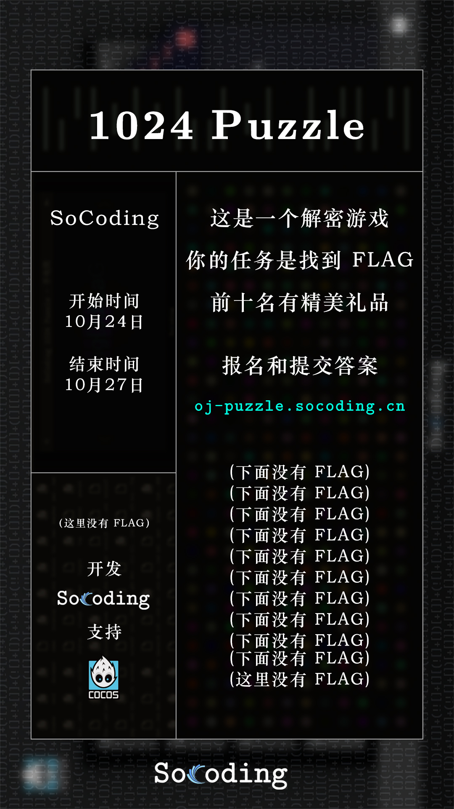
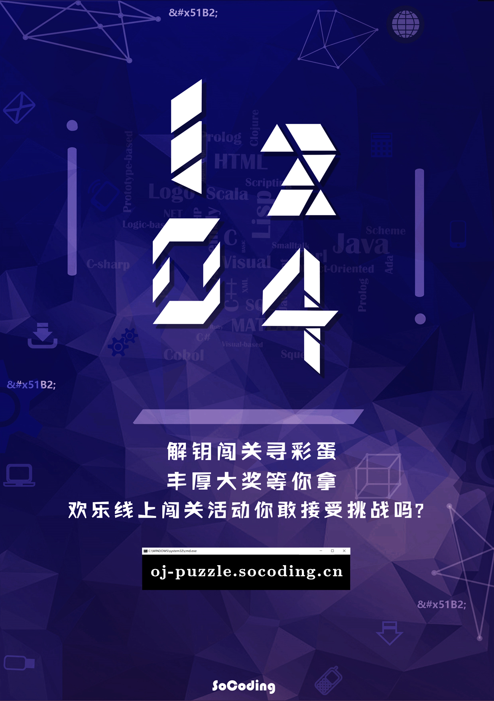

# 2021SoCoding1024Puzzle-writeups

**题解目前尚未公布**，现在还可以参与活动哦 👇

---

SoCoding 1024 解密游戏是一个在线的 Puzzle Game，形式类似 CTF 。谜题主要涉及计算机知识、网络技术、编程算法知识、数理化思维逻辑、生活常识/小技巧、ACGN 文化、电影/游戏/小说、梗等。

你的任务是从谜题中获得线索，寻找一串被隐藏起来的字符串（被称作FLAG），FLAG格式通常为 `flag{***}` ，是一串长度小于100的ASCII字符串。

SoCoding 1024 解密游戏由 Cocos 官方赞助，选手成绩按照过题量和时间排序，前10名有非常棒的奖品！SoCoding 1024 Puzzle 相比其它解密游戏有许多类似地方，但也有其特点。

**活动链接 🔗  [SoCoding 1024 Puzzle——https://oj-puzzle.socoding.cn/](https://oj-puzzle.socoding.cn/)**

---

<table><tr>
<td></td>
<td></td>
</tr></table>