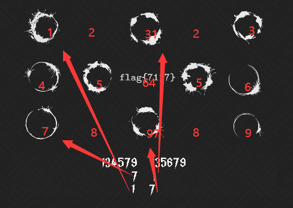

## 官方简要题解

### 01-签到

将屏幕上的字符串用任意编程语言标准输出就欧克了

### 02-手电筒

拖动一下发现是个3D模型，可以上下旋转，旋转之后就可以看到剩余完整的字符串了

### 03-闪烁

把完整字符串套个 `flag{}` 就行了

### 04-Wechat

微信搜索 Socoding 关注并发送 `flag` 就会自动回复

### 05-null

看起来什么都没有，但是鼠标点击屏幕中间并拖动会发现有一张图片，右键新标签内打开

### 06-QR

看一下发现很像平时看到的二维码，实际上确实就是。定位标志内的点缺失了，随便拿个画图工具把点补上，然后发现方向不对，镜像翻转之后就可以扫码了。

### 07-目录

看起来像是文件目录，应正如其名。但仔细看发现有 `window, document` 等目录，打开之后还能发现有 `head, body, title` 等子文件夹，然后意识到可能是把 Javascript DOM 对象转变为目录的形式。知道 Cocos Creator 的话，应该知道有个常量宏 `cc.macro`，打开之后就发现 `FLAG` 藏在里面。

### 08-()+[]!

发现是经典的 `JSFuck` ，一种利用 Javascript 语言特性，把任何 Javascript 代码转变为等价的由6种字符改写的代码。由于其还是 Javascript 代码，把它复制粘贴到开发者工具的控制台回车运行，发现是一个匿名方法，方法 return 了 FLAG。然后给上述代码最后补齐个括号（函数调用符）回车。

### 09-12

正如英文所说，FLAG 仅仅会在时针小于 0.5 度时出现，换算一下发现是每天 `12:00-12:01`和`00:00-00:01` ，然后等到这个时间就可以看到 FLAG 了。当然我不愿意等，所以把电脑本地时间改一下就好了。

### 10-柱

看提示，8个0应该提示是8个数字。然后隐约发现有个3，把3逆时针旋转90度后发现形状能够契合。然后发现顺着空隙能描出数字。

### 11-绑架

发现是经典的 IPv4 地址，把二进制转换为十进制数字后查询 IP ，发现一个地点广东省深圳市，拼音 `GuangdongShenzhen` 。发现符合提示，验证了答案的正确性，直接提交。

### 12-./Flag

下载之后发现是一个未知的文件，根据提示的意思明白它是个 Linux 系统程序。在 Ubuntu 系统内输入 `./Flag` 回车运行，发现输出 `ThereIsNoFlag!!` 。用16进制查看器打开后，搜索字符串 `flag{` 就找到了。当然这题也可以用 IDA pro，但这就大材小用了，搜索文件内出现的字符串， Linux 系统下用 `grep` 最简便了。

### 13-买瓜

发现中间那个点可以左右滑动，出现了一系列 `FLAG` ，但显然瓜是两块钱一斤，所以要把数字滑到 2 。但发现无论如何都很难滑到 2 ，将滑条滑到 0 和 10 发现`flag{}` 内的字符串有规律变化，似乎是 26 进制，然后尝试取几个点，把 26 进制数字转为 10 进制，做一个拟合发现是线性的。得到直线公式后能解得 2 块钱一斤时的数值，其 26 进制便是 FLAG。

### 14-Anime

应该是把三个番剧名字用 ASCII 字符按顺序拼接起来，发现第一个是总之就是那么可爱，第二个是ReLIFE，第三个是Lain。第一个用拼音！

### 15-Character

如果由有足够高的浓度，会发现是 《爱因斯坦携爱敬上》里的有村路美 `ArimuraRomi` 。

### 16-FindWaifu

老婆怎么会掉色呢？看样子又得靠浓度了。经过一番疯狂寻找应该能够找齐6个人的名字

### 17-丘丘人的宝箱

明示AES-ECB加密了，密钥是128位， `2^128=340282366920938463463374607431768211456` 暴力要到宇宙毁灭，是不可能的。但是题目提示说不要念四遍，意思可能是密钥是由某一段字符串重复4遍的。知道128位等于16个ASCII字符，只用枚举 `2^(128/4)=4294967296` 个字符串就OK了，很快啊，就暴力出来了。

### 18-太空的声音

发现是SSTV，把图像编码为声音，用Robot36解码就可以了。


### 19-Meow

图片隐藏了文字：猫会变换吗。提示猫变换，用Python执行一下逆猫变换就可以看到FLAG了

### 20-Document

下载后的文件解压后发现是一堆目录和xml文件，分析后可以发现是表格文件，将文件压缩为zip，再把后缀名改成xlsx就可以了

### 21-0b01

题解出自lr580

#### 解法一

数据量比较小，直接按照题意模拟即可，可以开设 $1000$ 个动态数组(链表)，然后模拟合并操作。时间复杂度为 $\Omicron(n^2)$ 。具体实现细节参见代码(C++)：

```c++
#define n 1000
#define m 580
ll fa[n + 2], sum[n + 2], num[n + 2], ansi;
vector<ll> g[n + 2];

signed main()
{
    for (ll i = 1; i <= n; ++i)
    {
        fa[i] = i;
        g[i].emplace_back(i);
    }

    for (ll i = 1; i <= m; ++i)
    {
        ll j = (i * i + i * m) % n + 1, fj = fa[j];
        for (ll k : g[fj])
        {
            fa[k] = fa[i];
            g[fa[i]].emplace_back(k);
        }
        g[fj].clear();
    }

    ll w = 0;
    for (ll i = 1; i <= n; ++i)
    {
        for (ll j : g[i])
        {
            sum[i] += j;
        }
        num[i] = g[i].size();
        w += g[i].size();
    }

    for (ll i = 1; i <= n; ++i)
    {
        if (num[i] > num[ansi] || (num[i] == num[ansi] && sum[i] > sum[ansi]))
        {
            ansi = i;
        }
    }
    printf("%lld", num[ansi] * sum[ansi]);
    return 0;
}
```


#### 解法二

学过算法的选手应该很快能看出，这就是一道并查集的模板题。直接用并查集知识解之即可。时间复杂度为 $\Omicron(n)$ 。具体实现细节参见代码(C++)：

```c++
#define n 1000
#define m 580

ll fa[n + 2], num[n + 2], sum[n + 2], ansi;
ll finds(ll k)
{
    while (k != fa[k])
    {
        k = fa[k];
    }
    return k;
}

signed main()
{
    for (ll i = 1; i <= n; ++i)
    {
        fa[i] = i;
    }
    for (ll i = 1; i <= m; ++i)
    {
        ll j = (i * i + i * m) % n + 1;
        fa[finds(j)] = finds(i);
    }
    for (ll i = 1; i <= n; ++i)
    {
        ll k = finds(i);
        num[k]++;
        sum[k] += i;
    }
    for (ll i = 1; i <= n; ++i)
    {
        if (num[i] > num[ansi] || (num[i] == num[ansi] && sum[i] > sum[ansi]))
        {
            ansi = i;
        }
    }
    printf("%lld", num[ansi] * sum[ansi]);
    return 0;
}
```

### 22-0b02

题解出自lr580

分析题意，即求 $a^x \equiv b(\bmod p)$ 的最小整数解 $x$ 。不可以用快速幂枚举，时间复杂度为 $\Omicron(p\sqrt p)$ 。可以使用数论算法的 BSGS 算法直接求解本题。BSGS 的适用条件为 $a\bot p$ 。若 $a\not\bot p$ ，则可以发现 $a^x\bmod p$ 恒为 $a$ ，即 $a=b$ ，则此时显然也有 $x=1$ 为答案。时间复杂度为 $\Omicron(\sqrt p)$ 。

注意最后输出 $x^x\bmod p$ 时需要使用快速幂算法，时间复杂度也为 $\Omicron(\sqrt p)$ 。

> BSGS算法具体请参考[这篇文章](https://oi-wiki.org/math/number-theory/bsgs/)。本题也可以使用 exBSGS 算法求解。

参考代码如下：

```c++
#define mn 1000700
#define mod 1000007
struct hasht
{
    ll mp[mn], hsh[mn]; //避免关键字冲突map,hash
    il ll find(ll x)    //拉链法构造散列表
    {
        ll t = x % mod;
        for (; mp[t] != x && mp[t] != -1; (t += 107) %= mod)
            ;
        return t;
    }
    il void insert(ll x, ll i)
    {
        ll f = find(x);
        mp[f] = x, hsh[f] = i;
    }
    il bool in(ll x)
    {
        return mp[find(x)] == x;
    }
    il ll get_hash(ll x)
    {
        return hsh[find(x)];
    }
    il void init()
    {
        memset(hsh, -1, sizeof hsh), memset(mp, -1, sizeof mp);
    }
} h;

ll qpow(ll a, ll b, ll p)
{
    ll r = 1;
    for (; b; b >>= 1, (a *= a) %= p)
    {
        if (b & 1)
        {
            (r *= a) %= p;
        }
    }
    return r;
}

ll a, b, p, m, s; //long long

signed main()
{
    sc(p), sc(a), sc(b);
    h.init();
    m = ceil(sqrt((db)p)) + 1, s = 1;
    for (ll i = 1; i <= m; ++i)
    {
        h.insert(b, i);
        s = (1LL * s * a) % p, b = (1LL * a * b) % p;
    }
    a = s;
    for (ll i = 1; i <= m; ++i)
    {
        if (h.in(a))
        {
            ll x = i * m - h.get_hash(a) + 1;
            printf("flag{%lld}", qpow(x, x, p));
            return 0;
        }
        a = (1LL * a * s) % p;
    }
    return 0;
}
```

### 23-指针

其实是brainfuck语言，数字代表前一个字符重复的次数

### 24-7

类似水墨的圈圈，其实是电影《降临》中外星人的文字，通过网络搜索可以发现每个圈代表的含义。



### 25-琴声

通过分析音符发现是圆周率前100位

### 26-wDream

base64字符串逆序了，解码后可以看到似乎是一首歌词（诗），但是文字中有错字。按顺序拼接错字的拼音就是FLAG了

### 27-Dot

发现有些点位置一直不动，它的位置索引就是FLAG

### 28-MSJump

在网页链接后输入参数打开网页，会进入一个跳跃的小游戏。每个挡板中间的缝隙相对于下面的一个的偏向，编码了一串莫斯电码。